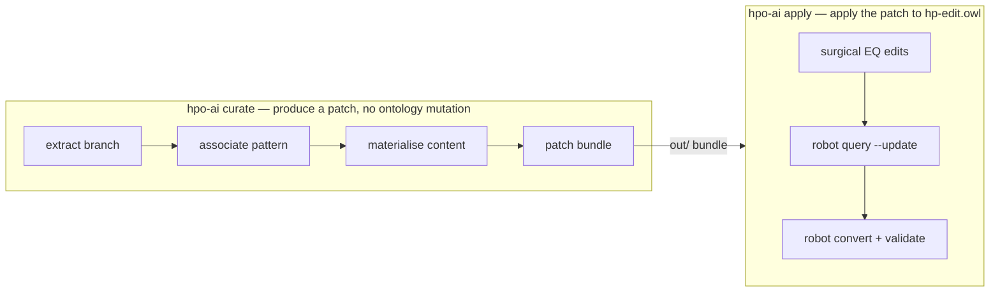

# hpo-ai

[](https://github.com/monarch-initiative/hpo-ai/actions/workflows/main.yaml)
[](https://monarch-initiative.github.io/hpo-ai/)
[](https://www.python.org/)
[](https://github.com/astral-sh/ruff)
[](https://mypy-lang.org/)
[](LICENSE)

AI-assisted pipeline for harmonising **chemical phenotypes** in the
[Human Phenotype Ontology](https://hpo.jax.org/) (HPO).

📖 **[Documentation](https://monarch-initiative.github.io/hpo-ai/)** ·
[Pipeline walkthrough](https://monarch-initiative.github.io/hpo-ai/pipeline-walkthrough/) ·
[Regression corpus](https://monarch-initiative.github.io/hpo-ai/corpus-failure-modes/)

> **Status: prototype, under active development.** The pipeline works, is tested
> against a regression corpus mined from merged HPO PRs, and has produced real
> curation batches — but interfaces still change without notice, and the `apply`
> step is an explicit stop-gap (see [below](#why-two-apply-mechanisms)).

---

## What it does

HPO contains hundreds of *chemical phenotype* terms — terms describing an
abnormal level of a chemical or protein entity in a body fluid (e.g. *Increased
CSF lactate*, *Hypercalcemia*, *Elevated circulating creatine kinase*). Many
predate HPO's adoption of
[DOSDP](https://github.com/INCATools/dead_simple_owl_design_patterns) design
patterns and are inconsistent:

- **Arbitrary wording** — "glucose *level*" vs "calcium *concentration*" for identical semantics.
- **Missing logical definitions** — no OWL axiom linking the term to CHEBI/UBERON.
- **Wrong or missing CHEBI/PRO annotations** — ion form used where HPO conventionally uses the atom form.
- **Inconsistent abbreviation** — some labels use "CK", others spell out "creatine kinase".

`hpo-ai` reads a branch of HPO, decides how each term *should* look according to
a declared pattern, and writes a reviewable patch — so a curator audits decisions
in a spreadsheet instead of hand-editing OWL.

---

## The two workflows



**`curate`** never touches the ontology. It writes:

| Artifact | Contents |
|---|---|
| `curate.kgcl` | KGCL patch — `rename`, `create exact synonym`, `change definition` |
| `update.ru` | the same changes compiled to a reification-aware SPARQL update |
| `axioms.ofn` | `EquivalentClasses(…)` axioms (KGCL can't express nested class expressions) |
| `review.tsv` | one row per term: current vs proposed, source, pattern, chemical, confidence |
| `unmapped.tsv` | terms no route could map, with reasons |

**`apply`** takes that bundle and edits `hp-edit.owl` in place.

Nothing is auto-applied on confidence: `curate` patches every cleanly-associated
term and leaves triage to the human reading `review.tsv`.

### Patterns

Nine patterns ship in [`patterns/`](patterns) — **{increased, decreased,
abnormal} × {blood, CSF, urine}** — seeded from HPO's DOSDP patterns (kept in
[`patterns/dosdp/`](patterns/dosdp)) but written to the fluid-first naming
convention of HPO issue #11702. A pattern declares its selector, variables,
label/definition/synonym templates and an `equivalentTo` axiom template.

### Auditable decision stores

Every machine decision lands in a git-diffable TSV under `--mappings-dir`, behind
a **lock gate**: a re-run never overwrites a row a curator owns.

| Store | Decides |
|---|---|
| `clinical_chemical.sssom.tsv` | the chemical behind an opaque clinical term (*Hypoglycorrhachia* → glucose) |
| `pattern_association.tsv` | which pattern each HP term got |
| `preferred_clinical_term.tsv` | the clinical term for a concept, plus a `common` flag |

The associators read through these stores *before* calling any LLM, so a curated
or cached row short-circuits the model. To override: edit the cell, set
`status=CONFIRMED`, re-run.

### Why two apply mechanisms?

A documented stop-gap. KGCL cannot yet express nested logical axioms, and its
reference apply engine mangles HPO's functional syntax — so EQ axioms are edited
surgically and the rest goes through `robot query --update`. The intended end
state is a single upstream `ontology.apply_patch(kgcl)`.

---

## Installation

Dependencies are managed with [`uv`](https://docs.astral.sh/uv/) and commands run
through [`just`](https://just.systems/).

```bash
uv sync --group dev        # install (or: just install)
uv run hpo-ai --help
```

The deterministic path needs no API key. The LLM tiers (`--use-llm`, Claude API)
are an optional layer on top.

### Example run

```bash
# Workflow A — produce a patch bundle for the CSF metabolite branch
uv run hpo-ai curate \
  --branch HP:0025454 \
  --pattern-dir patterns \
  --hpo sqlite:obo:hp \
  --mappings-dir mappings/ \
  --out out/

# Workflow B — apply it (needs ROBOT and a local hp-edit.owl)
uv run hpo-ai apply \
  --patch out/ \
  --hpo path/to/hp-edit.owl \
  --catalog path/to/catalog-v001.xml
```

### CLI

| Command | Purpose |
|---|---|
| `curate` | **Workflow A** — read an HP branch, produce a KGCL patch bundle (no mutation) |
| `apply` | **Workflow B** — apply a patch bundle to `hp-edit.owl` |
| `extract` | Extract candidate chemical phenotypes from HPO |
| `build-packets` | *Legacy* — resolve entities, assign patterns, score → evidence packets |
| `export` | *Legacy* — write packets to a review TSV |
| `generate-robot` | *Legacy* — generate a ROBOT template from approved packets |
| `validate` | Validate evidence packets |
| `stats` | Summarise packets (status, patterns, change types, confidence) |
| `run-pipeline` | *Legacy* — run extract → build-packets → export → ROBOT end to end |

The `build-packets` family is the earlier evidence-packet design, documented in
[the legacy overview](https://monarch-initiative.github.io/hpo-ai/overview/).

---

## Development

```bash
just test                  # pytest + doctests + mypy + ruff  (what CI runs)
just pytest                # default suite only — offline and deterministic
just pytest-integration    # tests needing network, ROBOT or ontology databases
just doctest               # doctests in src/ only
just _serve                # local docs server (mkdocs)
```

The default suite is deliberately offline: tests marked `integration`, `slow` or
`llm` are excluded, so CI never depends on an ontology download or an API key.
Run them with `just pytest-integration`.

Doctests are used heavily as both documentation and tests. Please add tests
before implementing a feature — see [`CONTRIBUTING.md`](CONTRIBUTING.md).

---

## Repository layout

```
src/hpo_ai/
  cli.py                 # Typer CLI (the commands above)
  pipeline/              # curate / apply orchestration
  extraction/            # HP term extraction via OAK
  associate/             # term → pattern association (deterministic + agentic tiers)
  patterns/              # pattern loader + LinkML meta-schema for patterns
  enrichment/            # CHEBI/PRO resolution, name normalisation, selection rules
  generate/              # materialise pattern templates into proposals
  patch/                 # KGCL + SPARQL patch generation
  apply/                 # surgical EQ editing, ROBOT invocation
  provenance/            # auditable decision stores
  read/                  # current ontology state
  scoring/               # confidence scoring
  validation/            # proposal validation
  packets/, output/      # legacy evidence-packet pipeline
  schema/hpo_ai.yaml     # LinkML schema — source of truth for the data model
  datamodel/             # Pydantic models generated from the schema

patterns/                # declared patterns (9) + patterns/dosdp/ originals
sparql/                  # SPARQL queries for term extraction
conf/                    # config.yaml, CHEBI selection rules + guide, normalisation rules
docs/                    # MkDocs Material site
specs/                   # design specs
tests/                   # ~350 tests incl. the merged-PR regression corpus
examples/                # sample input and example pipeline outputs
```

### Data model (LinkML → Pydantic)

Defined in `src/hpo_ai/schema/hpo_ai.yaml`; regenerate with:

```bash
uv run gen-pydantic src/hpo_ai/schema/hpo_ai.yaml > src/hpo_ai/datamodel/hpo_ai.py
```

- `HPTerm` — extracted term with label, definition, synonyms, existing annotations
- `ChemicalEntityEvidence` — a CHEBI/PRO match with confidence
- `PatternAssignment` — pattern + location + direction
- `CurationProposal` — proposed label, definition, synonyms, logical axiom, change type
- `EvidencePacket` — container tying it all together with an overall score

### Configuration

- `conf/config.yaml` — thresholds, scoring weights, ontology sources, preferred CHEBI forms
- `conf/chebi_selection_rules.yaml` — abbreviation lookups + curated name→CHEBI/PRO mappings
- `conf/chebi_selection_guide.md` — prose disambiguation rules injected into the LLM prompt
- `conf/name_normalization_rules.yaml` — strip PRO species suffixes / verbose names

Two domain conventions worth knowing: HPO uses **atom** forms of elements
(`calcium atom`, not `calcium(2+)`, per
[upheno#946](https://github.com/obophenotype/upheno/issues/946)), and the
canonical naming rules live upstream as SPARQL in
[human-phenotype-ontology](https://github.com/obophenotype/human-phenotype-ontology)
`src/sparql/` — this pipeline mirrors them.

---

## Tech stack

[OAK](https://incatools.github.io/ontology-access-kit/) (ontology access) ·
[LinkML](https://linkml.io/) + [Pydantic](https://docs.pydantic.dev/) (data model) ·
[KGCL](https://github.com/INCATools/kgcl) (change language) ·
[ROBOT](http://robot.obolibrary.org/) (OWL editing) ·
[Claude API](https://docs.anthropic.com/) (optional enrichment) ·
[Typer](https://typer.tiangolo.com/) (CLI) · Python 3.10+

---

## Further reading

- [`strategy.md`](strategy.md) — problem statement and design rationale
- [`specs/`](specs) — design specs for individual pieces of the pipeline
- [`docs/corpus-failure-modes.md`](docs/corpus-failure-modes.md) — regression corpus and known divergences from curator output
- [`todo.md`](todo.md) — outstanding curation-quality issues

---

## License

Apache-2.0 — see [`LICENSE`](LICENSE).
