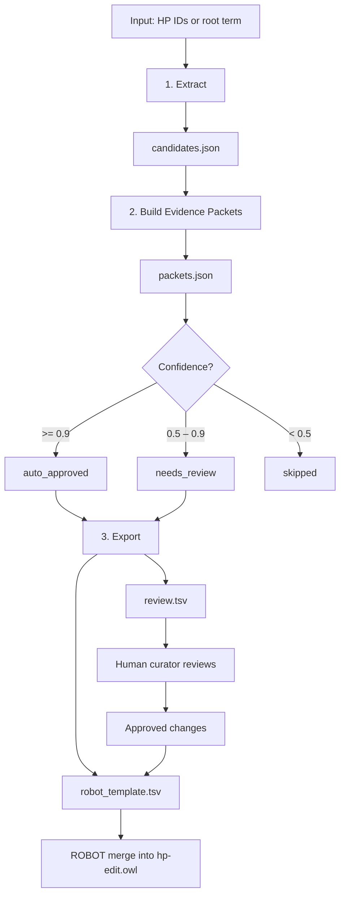
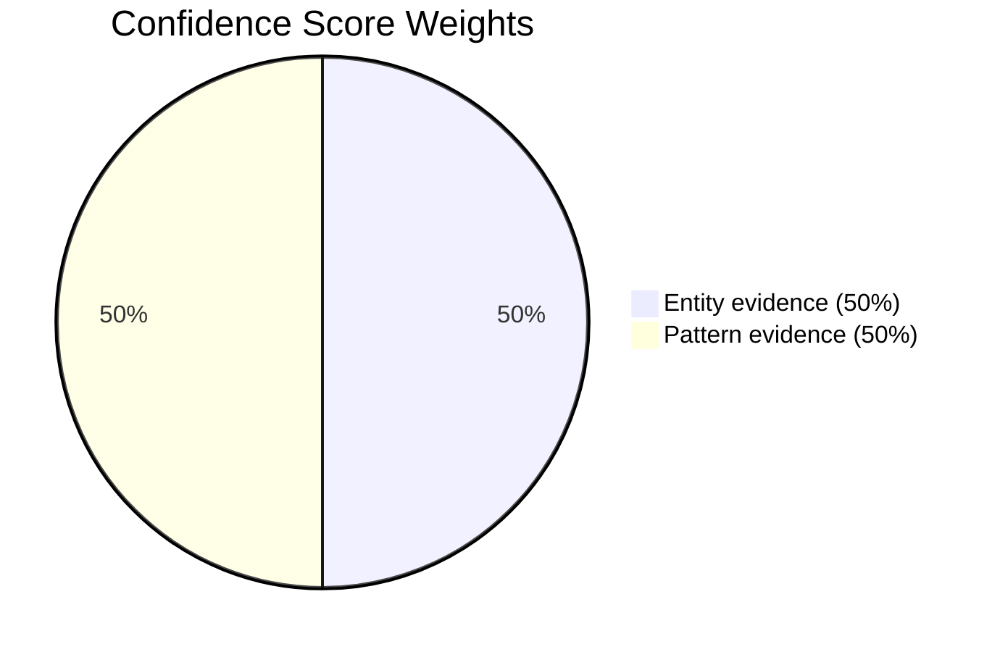

# Pipeline Overview

## The Problem

The Human Phenotype Ontology (HPO) contains hundreds of chemical phenotype
terms -- terms that describe abnormal levels of chemical or protein entities
in bodily fluids.  Many of these terms were created before HPO adopted
DOSDP (Dead Simple Ontology Design Patterns) for systematic naming and
logical definitions.  As a result, legacy terms are inconsistent:

| Issue | Example |
|---|---|
| Arbitrary word choice | "glucose *level*" vs "calcium *concentration*" -- identical semantics, different wording |
| Missing logical definitions | No OWL axiom linking the term to CHEBI/UBERON |
| Incorrect or missing CHEBI/PRO annotations | Ion form used instead of atom form |
| Inconsistent abbreviation | Some labels use "CK", others spell out "creatine kinase" |

Manually curating each term is slow.  **hpo-ai** automates the
evidence-gathering, pattern-matching, and proposal-generation steps so that
a human curator only reviews a pre-populated spreadsheet.

---

## User Story

> *As an HPO curator, I want to harmonise all chemical phenotype terms
> under `HP:0001939` (Abnormality of metabolism / homeostasis) so that
> every term has a consistent label, definition, logical axioms, and correct
> CHEBI / PRO annotation -- without manually researching each chemical
> entity.*

---

## Pipeline at a Glance



Each numbered stage is a CLI command and can be run independently or chained
together with `run-pipeline`.

---

## Concrete Walkthrough

Below is a step-by-step trace of what happens when the pipeline processes
**HP:0011015 -- "Abnormal blood glucose concentration"**.

### Stage 1 -- Extract

```bash
hpo-ai extract --from-tsv example_output/sample_input.tsv \
               --output candidates.json
```

The extractor loads the HP terms listed in the TSV, fetches their metadata
from the HPO via OAK (label, definition, synonyms, parents, any existing
CHEBI or UBERON annotations), and writes a JSON array of `HPTerm` objects:

```json
{
  "id": "HP:0011015",
  "label": "Abnormal blood glucose concentration",
  "definition": "An abnormality of the concentration of glucose in the blood.",
  "synonyms": [
    { "value": "Abnormality of blood glucose concentration", "scope": "exact" }
  ],
  "parents": ["HP:0011014"]
}
```

Terms are identified as chemical-phenotype candidates by keyword matching
("concentration", "level", "-emia", "-uria", etc.) and regex patterns.

### Stage 2 -- Build Evidence Packets

```bash
hpo-ai build-packets candidates.json --output packets.json
```

This is the core of the pipeline.  For each `HPTerm` the
`EvidencePacketBuilder` runs four sub-steps:

#### 2a. Collect Chemical Evidence

The resolver tries to identify *what chemical entity* the term is about.

**Resolution order** (first match wins for the deterministic layers):

| Layer | Source | Example |
|---|---|---|
| Abbreviation lookup | `conf/chebi_selection_rules.yaml` | "LDL" -> CHEBI:47774 |
| Curated mapping | `conf/chebi_selection_rules.yaml` | "calcium" -> CHEBI:22984 (atom) |
| OAK `basic_search` | CHEBI SQLite | "glucose" -> CHEBI:17234 (conf 0.98) |
| LLM extraction (opt.) | Claude API + selection guide | complex disambiguation |

For "Abnormal blood glucose concentration", the name "glucose" is extracted
from the label and searched against CHEBI.  OAK returns an exact match:

```json
{
  "entity_id": "CHEBI:17234",
  "entity_label": "glucose",
  "confidence": 0.98,
  "evidence_type": "chebi_match"
}
```

If the user passes `--use-llm`, an LLM enricher can additionally extract
entities, guided by domain rules in `conf/chebi_selection_guide.md`
(e.g., "prefer atom forms for elements", "enzymes should use PRO not CHEBI").

#### 2b. Assign DOSDP Pattern

The `PatternAssigner` determines which DOSDP template fits the term using
regex-based heuristics:

1. **Direction** -- "Hyper-", "elevated", "increased" -> `increased`;
   "Hypo-", "decreased" -> `decreased`; otherwise `abnormal`.
2. **Location** -- "blood", "serum", "plasma", "-emia" -> `UBERON:0000178`
   (blood); "urine", "urinary", "-uria" -> `UBERON:0001088` (urine).
3. **Pattern** -- The combination selects a template, e.g.
   `abnormalLevelOfChemicalEntityInBlood`.

For our term: direction = `abnormal`, location = `blood` ->
**abnormalLevelOfChemicalEntityInBlood** (confidence 0.80).

#### 2c. Generate Curation Proposal

The `ProposalGenerator` fills in the selected DOSDP template with the
resolved chemical entity:

| Field | Original | Proposed |
|---|---|---|
| **Label** | Abnormal blood glucose concentration | Abnormal circulating glucose concentration |
| **Definition** | An abnormality of the concentration of glucose in the blood. | Any deviation from the normal concentration of glucose in the blood circulation. |
| **Logical def** | *(none)* | `'phenotype' and ('has abnormal amount' some (CHEBI:17234 and ('part of' some UBERON:0000178)))` |
| **Synonyms** | Original label kept as exact synonym; pattern-based variants added |

The template comes from the DOSDP YAML
(`patterns/dosdp/abnormalLevelOfChemicalEntityInBlood.yaml`):

```yaml
name:
  text: "Abnormal circulating %s concentration"
  vars: [chemical]

def:
  text: "Any deviation from the normal concentration of %s ..."
  vars: [chemical]

equivalentTo:
  text: "'phenotype' and ('has abnormal amount' some (%s and ...))"
  vars: [chemical]
```

#### 2d. Score and Triage

The `ConfidenceScorer` combines four raw signals into two composite
dimensions, each weighted equally:

| Dimension | Raw signals | Combination | Weight |
|---|---|---|---|
| **Entity evidence** | Chemical match, Existing annotations | `max()` | 50% |
| **Pattern evidence** | Pattern fit, Label similarity | `max()` | 50% |

Within each dimension the signals are combined with `max()` because they
answer the same underlying question: entity evidence asks *"do we know
what chemical this term is about?"* and pattern evidence asks *"do we
know what DOSDP template to use?"*.  When both dimensions are strong the
overall score approaches 1.0 and the term is auto-approved.

For our glucose example:

| Signal | Value | Rationale |
|---|---|---|
| Chemical match | 0.98 | Exact CHEBI match for "glucose" |
| Existing annotations | 0.00 | No pre-existing CHEBI/UBERON axioms |
| Pattern fit | 0.80 | Standard blood pattern, direction + location detected |
| Label similarity | 0.90 | Minor wording change |

Entity evidence = max(0.98, 0.00) = **0.98**
Pattern evidence = max(0.80, 0.90) = **0.90**
**Overall confidence = 0.98 × 0.5 + 0.90 × 0.5 = 0.94** -> `auto_approved`.

The complete evidence is assembled into an `EvidencePacket`:

```json
{
  "id": "pkt_776c0a800bf9",
  "hp_term": { "id": "HP:0011015", "label": "Abnormal blood glucose concentration" },
  "chemical_evidence": [{
    "entity_id": "CHEBI:17234",
    "entity_label": "glucose",
    "confidence": 0.98
  }],
  "pattern_assignment": {
    "pattern_name": "abnormalLevelOfChemicalEntityInBlood",
    "direction": "abnormal",
    "location_id": "UBERON:0000178"
  },
  "proposal": {
    "proposed_label": "Abnormal circulating glucose concentration",
    "proposed_chemical_entity": "CHEBI:17234",
    "proposed_logical_definition": "'phenotype' and ('has abnormal amount' some (CHEBI:17234 ...))",
    "change_type": "full_refactor"
  },
  "overall_confidence": 0.94,
  "review_status": "auto_approved"
}
```

### Stage 3 -- Export for Review

```bash
hpo-ai export packets.json --output review.tsv
```

Packets are written to a TSV matching the existing `curated_phenotypes.tsv`
format used by HPO curators.  Key columns:

| Column | Value |
|---|---|
| `hpo_id` | HP:0011015 |
| `hpo_label` | Abnormal blood glucose concentration |
| `MANUAL PREFERED LABEL` | Abnormal circulating glucose concentration |
| `MANUAL PREFERRED DEFINITION` | Any deviation from the normal concentration of glucose ... |
| `chemical_entity` | CHEBI:17234 |
| `chemical_entity_label` | glucose |
| `correct_pattern` | abnormalLevelOfChemicalEntityInBlood |
| `confidence` | 0.83 |
| `finished` | to do |

A human curator reviews and sets `finished` to `done` (accept),
`to do` (needs work), or `ignore` (reject).

### Stage 4 -- Apply via ROBOT Template

```bash
hpo-ai generate-robot packets.json --output robot_template.tsv
```

Approved changes are exported as a ROBOT template that can be merged
directly into `hp-edit.owl`:

| ID | LABEL | A IAO:0000115 | SC ... |
|---|---|---|---|
| HP:0011015 | Abnormal circulating glucose concentration | Any deviation from ... | `'has abnormal amount' some (CHEBI:17234 ...)` |

The ROBOT template is processed by the OBO Foundry's standard build
pipeline to apply the changes.

---

## Shortcut: Full Pipeline

All stages can be run in one command:

```bash
hpo-ai run-pipeline \
  --input example_output/sample_input.tsv \
  --output-dir output/ \
  --chebi-rules conf/chebi_selection_rules.yaml \
  --selection-guide conf/chebi_selection_guide.md
```

This creates:

```
output/
  candidates.json         # Extracted terms
  packets.json            # Evidence packets
  review.tsv              # Full review spreadsheet
  auto_approved.tsv       # High-confidence proposals
  needs_review.tsv        # Medium-confidence proposals
  robot_template.tsv      # ROBOT template for approved changes
```

---

## CHEBI Selection Rules

Chemical entity resolution is the most nuanced part of the pipeline.
When OAK searches CHEBI for "calcium", it returns many candidates: atom,
ion, salt, compound, dietary form, metallic form, etc.  The system uses
two layers to pick the right one:

### Layer 1 -- Deterministic Rules (`conf/chebi_selection_rules.yaml`)

Fast lookups, no API calls.

**Abbreviations** map clinical shorthand to the correct ID:

```yaml
abbreviations:
  LDL:
    entity_id: "CHEBI:47774"
    entity_label: low-density lipoprotein cholesterol
  CK:
    entity_id: "PR:000050097"    # PRO, not CHEBI -- it's a protein
    entity_label: creatine kinase
```

**Curated mappings** encode known correct answers with aliases:

```yaml
curated_mappings:
  - chemical_name: calcium
    chebi_id: "CHEBI:22984"
    chebi_label: calcium atom
    aliases: ["Ca", "Ca2+", "calcium ion", "calcium(2+)"]
    rationale: "Per upheno#946, HPO uses atom forms"
```

### Layer 2 -- LLM Selection Guide (`conf/chebi_selection_guide.md`)

When the LLM enricher is enabled (`--use-llm`) and multiple CHEBI candidates
remain after deterministic lookup, a prose guide is injected into the LLM
system prompt.  This guide encodes nuanced domain rules:

- "Per upheno#946, HPO uses atom forms for elements"
- "Never pick salts, dietary forms, or role-based groupings"
- "Enzymes (-ase suffix) should use PRO, not CHEBI"
- "Prefer L-form amino acids unless D-form is explicit"

---

## Existing Annotations

Many HP terms already carry partial ontology annotations (CHEBI/PRO
entity links, UBERON locations, or OWL logical definitions) from
earlier curation passes.  The pipeline uses these *existing annotations*
in two ways:

### During chemical evidence collection (Stage 2a)

When the extractor finds that a term already has an
`existing_chemical_entity` (e.g. `CHEBI:27226` for uric acid), the
resolver looks up that ID and adds it to the evidence list with
**confidence 1.0** -- an existing annotation is treated as a trusted
ground truth.  This means the pipeline will not override a correct
annotation; it will only propose changes to the label, definition, and
synonyms.

### During confidence scoring (Stage 2d)

Existing annotations feed into the **entity evidence** dimension of the
confidence scorer.  A term with a CHEBI entity, a UBERON location, *and*
an OWL logical definition scores up to 1.0 on entity evidence -- even
without a new chemical search.  Combined with a strong pattern fit, such
terms are auto-approved without further review.

| Existing annotation | Entity score contribution |
|---|---|
| `existing_chemical_entity` set | +0.4 |
| `existing_location` set | +0.3 |
| `existing_logical_definition` set | +0.3 |

A term with all three annotations scores 1.0 on entity evidence before
any chemical search runs.

---

## Name Normalization

PRO (Protein Ontology) entity labels often include species suffixes and
verbose names that don't belong in HP term labels.  For example:

> `"DnaJ homolog subfamily B member 9 (human)"` should become `"DNAJB9"`

The `NameNormalizer` applies sequential string replacements loaded from
`conf/name_normalization_rules.yaml`, mirroring the SPARQL rewriting
rules used in the HPO build (`src/sparql/update-chemical-labels.ru`).

Rules are applied in two phases:

1. **Generic cleanups** (regex) -- strip suffixes like ` atom`,
   ` molecular entity`, ` (human)`
2. **Specific renames** (literal) -- e.g. `serotransferrin` -> `transferrin`,
   `creatine kinase B-type` -> `creatine kinase BB isoform`

The normalizer is injected into the `ProposalGenerator` and runs on
every chemical name before template insertion.  Use `--normalization-rules`
on the CLI to enable it:

```bash
hpo-ai build-packets candidates.json \
  --normalization-rules conf/name_normalization_rules.yaml
```

---

## Confidence Scoring

The overall confidence is a weighted combination of two composite
signals:



Each dimension is the `max()` of two raw sub-scores:

| Dimension | Sub-scores | Question answered |
|---|---|---|
| Entity evidence | Chemical match, Existing annotations | Do we know what chemical this is? |
| Pattern evidence | Pattern fit, Label similarity | Do we know what template to use? |

| Score Range | Review Status | Meaning |
|---|---|---|
| >= 0.9 | `auto_approved` | High confidence, apply directly |
| 0.5 -- 0.9 | `needs_review` | Curator should check |
| < 0.5 | `skipped` | Insufficient evidence |

---

## Module Map

```
src/hpo_ai/
  cli.py                    # Typer CLI (extract, build-packets, export, ...)
  extraction/               # HP term extraction via OAK
  enrichment/
    chebi.py                # CHEBI resolution (rules + OAK search)
    pro.py                  # PRO (Protein Ontology) resolution
    llm.py                  # LLM-based entity extraction + guide injection
    name_normalizer.py      # PRO/CHEBI label normalization (strip suffixes, renames)
    selection_rules.py      # Rule models, YAML loader, filter engine
  patterns/
    assigner.py             # DOSDP pattern assignment (direction + location)
    generator.py            # Curation proposal generation from templates
  scoring/
    scorer.py               # Two-signal confidence scoring
  validation/
    validator.py            # Pre-submission validation checks
  packets/
    builder.py              # Orchestrates enrichment -> pattern -> proposal -> score
  output/
    tsv.py                  # TSV export for curator review
    robot.py                # ROBOT template generation
  datamodel/
    hpo_ai.py               # Pydantic models (generated from LinkML schema)

conf/
  chebi_selection_rules.yaml       # Abbreviations + curated CHEBI mappings
  chebi_selection_guide.md         # Prose rules for LLM disambiguation
  name_normalization_rules.yaml    # Label normalization rules
  config.yaml                      # General pipeline configuration

patterns/dosdp/               # DOSDP pattern YAML files
sparql/                       # SPARQL queries for term extraction
```

---

## Technology Stack

| Tool | Role |
|---|---|
| [OAK](https://incatools.github.io/ontology-access-kit/) | Ontology access (HPO, CHEBI, PRO) |
| [LinkML](https://linkml.io/) | Data model schema |
| [Pydantic](https://docs.pydantic.dev/) | Runtime data validation |
| [DOSDP](https://github.com/INCATools/dead_simple_owl_design_patterns) | Ontology design patterns |
| [ROBOT](http://robot.obolibrary.org/) | OWL ontology editing |
| [Claude API](https://docs.anthropic.com/) | Optional LLM enrichment |
| [Typer](https://typer.tiangolo.com/) | CLI framework |
| [uv](https://docs.astral.sh/uv/) | Dependency management |
| [just](https://just.systems/) | Command runner |
