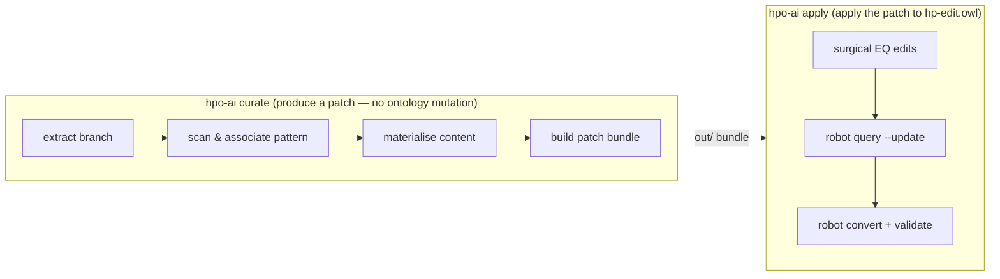

# HPO-AI pipeline walkthrough

A step-by-step tour of what the pipeline actually does, end to end. It follows a
single HP term from the ontology to a reviewable, applicable change.

The pipeline harmonises **chemical-phenotype** terms in the Human Phenotype
Ontology (HPO) — terms about the level of a chemical in a body fluid, e.g.
*"Increased CSF lactate"*. It rewrites them to follow declared **patterns**
(a simplified form of DOSDP), generates a reviewable patch, and can apply that
patch to the editors' file `hp-edit.owl`.

There are **two workflows**, run as two separate commands:



- **`curate`** reads a branch of HPO, decides how each term should look, and
  writes a *patch bundle* to an output directory. It never touches the ontology.
- **`apply`** takes that bundle and edits `hp-edit.owl` in place.

Everything the LLM decides is written to **human-editable TSV "decision stores"**
under `mappings/` so a curator can audit and override it, and re-runs never
clobber those edits.

---

## 0. Setup and inputs

| Input | What it is |
| --- | --- |
| `--branch HP:0025454` | The root HP term whose descendants are curated |
| `--pattern-dir patterns/` | The declared patterns (one YAML per direction × fluid) |
| `--hpo` | An OAK selector to read terms from (default `sqlite:obo:hp`) |
| `--mappings-dir mappings/` | The auditable decision stores (created if absent) |
| `--use-llm` | Enables the LLM tiers (off by default → fully deterministic) |
| ROBOT | `/Users/matentzn/tools/robot`, needed only by `apply` |

A pattern file (e.g. `patterns/increasedChemicalInCSF.yaml`) is the template that
drives generation:

```yaml
id: increasedChemicalInCSF
selector: { direction: increased, location: UBERON:0001359 }   # how a term is matched to it
qualifier: CSF                                                  # fluid-first qualifier (#11702)
vars:
  chemical: { range: CHEBI:24431, allow_string: true }         # may be a CHEBI id OR a bare string
  location: { range: UBERON:0001359, fixed: true }
name:       "Elevated CSF {chemical} concentration"
definition: "The concentration of {chemical} in the cerebrospinal fluid is above the upper limit of normal."
synonyms:
  - { scope: exact, text: "Increased {chemical} concentration" }
equivalentTo: "ObjectSomeValuesFrom(<…BFO_0000051> ObjectIntersectionOf(<…PATO_0000470> …{chemical}… {location}…))"
```

Nine patterns ship in `patterns/`: **{increased, decreased, abnormal} × {blood,
CSF, urine}**, seeded from HPO's DOSDP patterns but written to the issue-#11702
naming convention (fluid-first: `circulating` for blood, `CSF`, `urinary`).

---

## Workflow A — `hpo-ai curate`

```
hpo-ai curate --branch HP:0025454 --pattern-dir patterns --hpo sqlite:obo:hp --out out/
```

Orchestrated by `run_curate()` in `src/hpo_ai/pipeline/curate.py`.

### Step 1 — Extract the branch

`HPOExtractor` (`extraction/extractor.py`) uses OAK to pull every descendant of
the branch root and returns a list of `HPTerm` objects, each carrying the current
`label`, `definition`, `synonyms`, parents, and any existing logical definition.
For `HP:0025454` this is ~145 terms.

### Step 2 — Load patterns

`load_patterns()` (`patterns/loader.py`) reads every `*.yaml` in the pattern
directory into validated `Pattern` objects (generated from the LinkML meta-schema
`patterns/schema/pattern.yaml`).

### Step 3 — Associate each term with a pattern

This is the heart of the pipeline (`associate/deterministic.py`). For each term:

1. **Direction** — from the label: `increased` (hyper-, elevated, increased,
   high), `decreased` (hypo-, reduced, low, deficient), else `abnormal`.
2. **Location / fluid** — word-boundary match on label + definition:
   `blood`/`circulating`/`serum`/`plasma` → blood, `CSF`/`cerebrospinal` → CSF,
   `urinary`/`urine` → urine, plus clinical suffixes `-emia`→blood, `-uria`→urine,
   `-rrhachia`→CSF. (Word boundaries stop `ta**urine**` matching the fluid.)
   No fluid → the term is **unmapped** (`no_location`).
3. **Select the pattern** whose `selector` matches `(direction, location)`. None
   → `no_pattern`; more than one → `ambiguous`. A **curator-locked row** in the
   pattern store overrides this pick (see Step 7).
4. **Extract the chemical** from the label (the *compositional route*):
   `"Increased CSF taurine concentration"` → `taurine`. Two forms are handled —
   with a measurement noun ("… concentration/level") and without ("Increased CSF
   lactate").
5. If the label is an opaque **clinical term** with no extractable chemical
   (`"Hypoglycorrhachia"`), take the *clinical route*: look the chemical up in the
   clinical grounding store, or ask a small LLM (`--use-llm`) — glucose. Clinical
   terms **keep their current label as primary** (Step 6). No chemical at all →
   `no_chemical` (unmapped).
6. **Resolve the chemical** to a CHEBI/PRO entity (`enrichment/chebi.py`,
   `pro.py`, scored by `scoring/scorer.py`). Confident match → an **entity**;
   otherwise → a bare **string** (only allowed if the pattern's `allow_string` is
   true). This entity-vs-string distinction is the "twist": a string can fill the
   text templates but not the logical axiom.

If Tier 1 can't map a term confidently and `--use-llm` is on, **Tier 2** (the
agentic associator, `associate/agentic.py`) asks an LLM to pick among the
*existing* patterns and extract fillers. Anything neither tier maps lands in
`unmapped.tsv` with a reason.

### Step 4 — Decide the primary label (preferred clinical term)

Some concepts have an established clinical term that HPO prefers as the primary
label (`Increased blood glucose concentration` → **Hyperglycemia**). The
associator (`_preferred_label`) decides, cheapest-first:

1. If the current label is itself a clinical term (clinical route) → keep it.
2. Else find a candidate: an existing clinical-morphology exact synonym
   (`hyper…emia`), or — for blood/urine — ask the oracle to find one.
3. **Judge commonness**: a cheap cached LLM call (or a curated flag) marks the
   candidate `COMMON` or `OBSCURE`.
   - **Common** → promote it to the primary label; the descriptive pattern label
     and the old label become exact synonyms.
   - **Obscure** (e.g. `Hyperlactatorachia`) → keep the descriptive label as
     primary and add the clinical term as an exact synonym.

With no LLM and no curated flag, a candidate is treated as obscure (never
auto-promoted) — safe by default. `review.tsv` records the decision in
`primary_label_source ∈ {current_clinical, synonym, llm, pattern}`.

### Step 5 — Materialise the content

`materialize()` (`generate/materialize.py`) fills the chosen pattern's templates
into a `CurationProposal`:

- **label** — the preferred term, the preserved clinical label, or the pattern's
  `name`, per Step 4.
- **definition** — the pattern's `definition` template.
- **synonyms** — the pattern's synonym templates, plus every demoted label
  (pattern label, old label, obscure clinical term), de-duplicated.
- **logical definition (EQ axiom)** — the pattern's `equivalentTo`, with
  `{chemical}` and `{location}` substituted for their IRIs — **only when the
  chemical resolved to an entity** (the twist). A string filler gets no axiom.

### Step 6 — Build the patch

Only genuine differences from the term's current state become changes
(`read/current_state.py` supplies the current label/def/synonyms):

- **`curate.kgcl`** — the KGCL patch, the standard/interoperable artifact:
  `rename …`, `create exact synonym …`, `change definition …`
  (`patch/kgcl.py`, each line validated by the KGCL parser).
- **`update.ru`** — the same changes compiled to a SPARQL update
  (`patch/sparql.py`). Definition changes are **reification-aware**: they rewrite
  both the direct `IAO:0000115` triple and any reified `owl:annotatedTarget`, so
  an axiom-annotated definition isn't duplicated.
- **`axioms.ofn`** — the `EquivalentClasses(…)` axioms (KGCL can't express a
  nested class expression, so these are carried separately).

### Step 7 — Record decisions in the auditable stores

Every machine decision is written to a git-diffable, human-editable TSV under
`--mappings-dir`, with a **lock gate**: a re-run never overwrites a row a curator
owns (`mapping_justification = semapv:ManualMappingCuration`, or
`status ∈ {CONFIRMED, REJECTED}`, or `method = HUMAN`). The associators **read
through** these stores before calling any LLM, so a curated (or cached) row
short-circuits the model.

| Store | Key | Decides |
| --- | --- | --- |
| `clinical_chemical.sssom.tsv` | clinical term label | the chemical behind an opaque clinical term (→ CHEBI) |
| `pattern_association.tsv` | HP id | which pattern each term got (every pick, both tiers) |
| `preferred_clinical_term.tsv` | `direction\|chemical\|fluid` | the clinical term + a `common` flag |

To override anything: edit the cell, set `status=CONFIRMED` (or `method=HUMAN`),
re-run. The pipeline honours it and won't touch it again.

### Step 8 — Outputs

`out/` after a curate run:

```
curate.kgcl     # KGCL patch (label / synonym / definition)
update.ru       # SPARQL update compiled from the KGCL
axioms.ofn      # EquivalentClasses axioms to add/replace
review.tsv      # one row per term: current vs proposed, source, confidence, pattern, chemical
unmapped.tsv    # terms no tier could map, with reasons
```

Note: `curate` does **not** auto-approve or drop terms by confidence. The patch
covers every cleanly-associated term; `confidence` and the other columns in
`review.tsv` are there for a human to triage. Nothing is applied yet.

---

## Workflow B — `hpo-ai apply`

```
hpo-ai apply --patch out/ --hpo path/to/hp-edit.owl --catalog src/ontology/catalog-v001.xml
```

`apply_patch_bundle()` (`apply/runner.py`) mutates `hp-edit.owl` in place, in
order:

1. **Surgical EQ edits** (`apply/eq_editor.py`) — `hp-edit.owl` is OWL Functional
   Syntax (one axiom per line), so each `EquivalentClasses(<id> …)` line is
   added, or replaced when it differs, by a targeted single-line edit. Guarded and
   idempotent; a term whose defining line can't be found is skipped with a warning.
2. **`robot query --update update.ru`** — applies the label / synonym / definition
   changes through ROBOT's OWL API and re-serialises canonically (this also
   canonicalises the EQ edits from step 1).
3. **`robot convert`** — a final canonical pass; the diff then contains only the
   intended changes (ROBOT reproduces `hp-edit.owl` byte-for-byte, so anything
   extra would signal a bug).

**Why two mechanisms?** This is a documented **stop-gap**. KGCL can't yet express
nested logical axioms, and its reference apply engine mangles HPO's functional
syntax. The intended end state is a single `ontology.apply_patch(kgcl)` upstream
(tracked in `issues/issue_kgcl_apply_patch.md`). `apply` needs ROBOT and the
ontology's imports resolvable; without them it can still emit the patch bundle but
not apply it.

---

## Working example — the CSF branch, end to end

This is a real, reproducible run over the CSF metabolite branch `HP:0025454`
(deterministic, no `--use-llm`). Every snippet below is actual output.

### Run curate

```console
$ hpo-ai curate --branch HP:0025454 --pattern-dir patterns --out out/ --mappings-dir mappings/
  145 terms
Loaded 9 patterns from patterns
WARNING - 6 KGCL statement(s) not parseable (applied via SPARQL): [rename HP:6000206 …pyridoxal-5'-phosphate…]

Associated: 143
Unmapped:   2
    no_chemical: 2
KGCL statements: 627
EQ axioms:       109
Bundle written to out/
```

(The 6 "not parseable" lines are chemical names containing an apostrophe, which
the single-quote-only KGCL grammar can't express — they still apply via SPARQL.)

### What curate produced — following `HP:0002490` "Increased CSF lactate"

`out/review.tsv` (one row per term; a few columns shown):

| hpo_id | current_label | proposed_label | source | pattern | is_entity | eq |
| --- | --- | --- | --- | --- | --- | --- |
| HP:0002490 | Increased CSF lactate | **Elevated CSF lactate concentration** | pattern | increasedChemicalInCSF | True | True |
| HP:0500220 | Increased CSF tyrosine concentration | Elevated CSF tyrosine concentration | pattern | increasedChemicalInCSF | True | True |
| HP:0034455 | Increased CSF taurine concentration | Elevated CSF taurine concentration | pattern | increasedChemicalInCSF | True | True |

`out/curate.kgcl` (the annotation changes for that term):

```text
rename HP:0002490 from 'Increased CSF lactate' to 'Elevated CSF lactate concentration'
create exact synonym 'Increased CSF lactate' for HP:0002490
create exact synonym 'Increased lactate concentration' for HP:0002490
create exact synonym 'Elevated lactate level' for HP:0002490
create exact synonym 'Elevated CSF lactate level' for HP:0002490
change definition of HP:0002490 from 'Increased concentration of lactate in the cerebrospinal fluid.' to 'The concentration of lactate in the cerebrospinal fluid is above the upper limit of normal.'
```

`out/axioms.ofn` (the logical definition, entity case only — abbreviated):

```text
EquivalentClasses(<…/HP_0002490> ObjectSomeValuesFrom(<…/BFO_0000051> ObjectIntersectionOf(<…/PATO_0000470> …CHEBI_24996… UBERON_0001359…)))
```

`out/unmapped.tsv` — the two terms no route could map (opaque clinical names, no
chemical span, and no `--use-llm` to recover them):

```text
hpo_id      label                reason       detail
HP:0011972  Hypoglycorrhachia    no_chemical  could not extract a chemical span from the label
HP:0031885  Hyperglycorrhachia   no_chemical  could not extract a chemical span from the label
```

`mappings/pattern_association.tsv` — the auditable pattern ledger (one row per
pick; edit `pattern_id`, set `status=CONFIRMED` to lock and override next run):

```text
hpo_id      label                  pattern_id             chemical  method             confidence  status
HP:0002490  Increased CSF lactate  increasedChemicalInCSF  lactate   DETERMINISTIC_RULE  0.98        MACHINE
```

### Apply the bundle

Against a pristine copy of `hp-edit.owl`:

```console
$ hpo-ai apply --patch out/ --hpo hp-edit.owl --catalog src/ontology/catalog-v001.xml
EQ added:    30
EQ replaced: 9
EQ unchanged:70
EQ skipped:  0
SPARQL applied: True
Wrote hp-edit.owl
```

The term in `hp-edit.owl`, **before**:

```text
AnnotationAssertion(rdfs:label <…/HP_0002490> "Increased CSF lactate")
```

**after** — the label is the descriptive form, the old label is preserved as an
exact synonym, and the definition/EQ are updated (70 CSF terms already had a
correct EQ, so only 30 were added and 9 replaced):

```text
AnnotationAssertion(rdfs:label <…/HP_0002490> "Elevated CSF lactate concentration")
AnnotationAssertion(<…#hasExactSynonym> <…/HP_0002490> "Increased CSF lactate")
```

### Other terms in the same run

| Term | What happens |
| --- | --- |
| `HP:0034455` *Increased CSF taurine concentration* | word-boundary location fixes the `taurine`→urine trap → CSF; full label/def/EQ |
| `HP:0011972` *Hypoglycorrhachia* | with `--use-llm`: clinical route → glucose; **label preserved**, `Decreased CSF glucose concentration` added as synonym. Without it → `unmapped.tsv` |
| a blood-glucose term | preferred term **Hyperglycemia** (judged *common*) becomes primary; descriptive form demoted to synonym |
| an obscure clinical term (`Hyperlactatorachia`) | judged *obscure* → descriptive label stays primary, clinical term kept as an exact synonym |
| *increased CSF ribitol* | no clinical term → keeps the descriptive pattern label |

---

## Key data models

| Model | Where | Holds |
| --- | --- | --- |
| `HPTerm` | `datamodel/hpo_ai.py` | a term's current label/def/synonyms/axioms |
| `Pattern` | `datamodel/pattern.py` | selector, vars, name/def/synonym/EQ templates |
| `Association` | `associate/models.py` | chosen pattern + fillers + route + preferred-label decision |
| `CurationProposal` | `datamodel/hpo_ai.py` | proposed label/def/synonyms/EQ |
| `TermState` | `read/current_state.py` | current on-file state, for minimal diffs |
| `Unmapped` | `associate/models.py` | a term + why it couldn't be mapped |

---

## Command reference

Pattern-driven (current):

- `hpo-ai curate` — Workflow A: produce the patch bundle.
- `hpo-ai apply` — Workflow B: apply a bundle to `hp-edit.owl`.

Legacy packet pipeline (superseded by curate/apply, still present):

- `hpo-ai extract` — extract candidate terms to JSON.
- `hpo-ai build-packets` — build evidence packets (entity + pattern + proposal + score).
- `hpo-ai export` — export packets to the review TSV format.
- `hpo-ai generate-robot` — emit a ROBOT template from packets.
- `hpo-ai validate` / `stats` — check and summarise packets.
- `hpo-ai run-pipeline` — the old extract→packets→export chain in one command.

Design details live in `specs/2026-08-07-pattern-driven-curate-design.md`.
